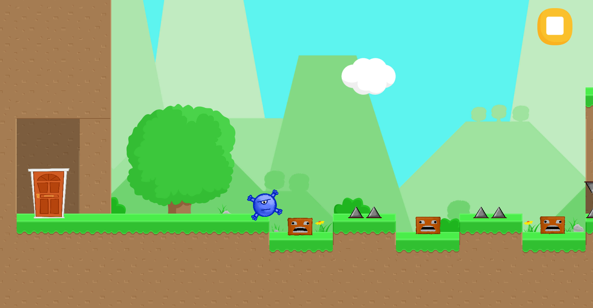
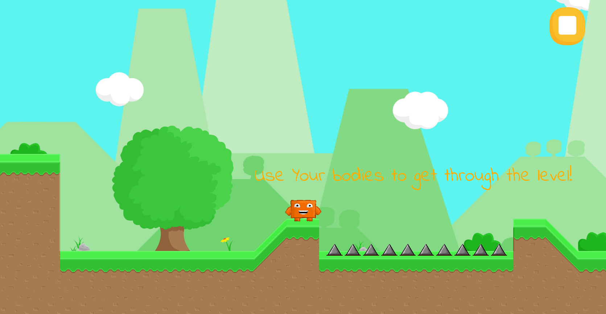
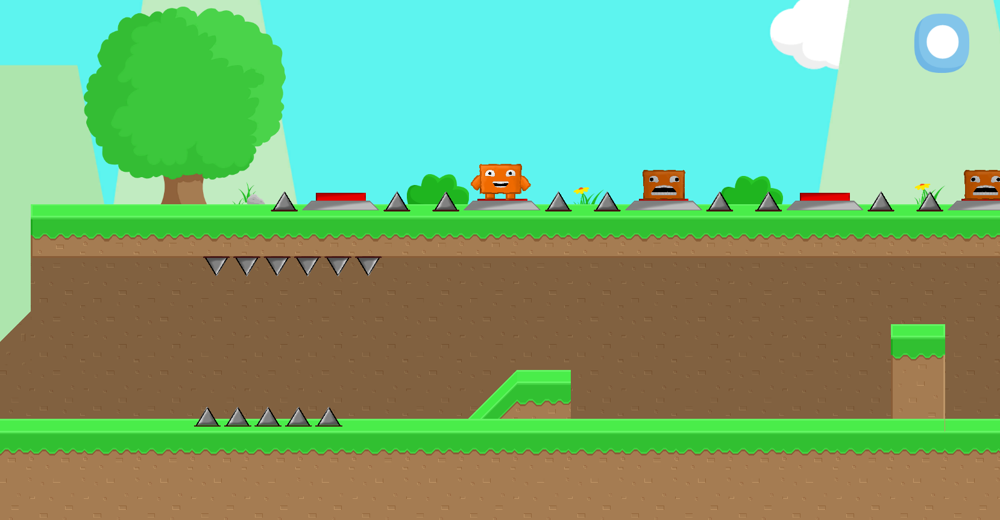

# FriendsBeyondTheEnd
## Platformer game, made as a submission for a GameJam in a week.
A small puzzle game developed for the [Brackeys GameJam 2020](https://itch.io/jam/brackeys-4) with the theme "Rewind," created within a week. The game features a unique mechanic where your dead bodies become essential objects to solve puzzles and complete levels. Use them wisely to succeed.
## Source folder
Most of my code is in [Scripts](Assets/Scripts) folder
## Screenshots

